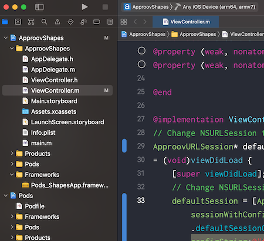

# Next Steps
Once you have finished a basic integration of the SDK and are able to see metrics from it, there are some further steps to provide full Approov integration.

These steps require access to the [Approov CLI](https://approov.io/docs/latest/approov-cli-tool-reference/), please follow the [Installation](https://approov.io/docs/latest/approov-installation/) instructions.

## ADDING API DOMAINS
In order for Approov tokens to be added by the interceptor for particular API domains is necessary to inform Approov about them. Execute the following command:

```
approov api -add <your-domain>
```
Approov tokens will then be added automatically to any requests to that domain (using the `Approov-Token` header, by default).

Note that this will also add a public key certicate pin for connections to the domain to ensure that no Man-in-the-Middle attacks on your app's communication are possible. Please read [Managing Pins](https://approov.io/docs/latest/approov-usage-documentation/#public-key-pinning-configuration) to understand this in more detail.

## REGISTERING APPS
In order for Approov to recognize the app as being valid it needs to be registered with the service. This requires building an `.ipa` file either using the `Archive` option of Xcode (this option will not be available if using the simulator) or building the app and then creating a compressed zip file and renaming it. Use the second option for which we have to make sure a `Generic iOS Device` is selected as build destination. This ensures an `embedded.mobileprovision` is included in the application package which is a requirement for the `approov` command line tool. 



You can now build the application by selecting `Product` and then `Archive`. Select the apropriate code signing options and eventually a destination to save the `.ipa` file (e.g. `app.ipa`).

```
approov registration -add app.ipa
```

> **IMPORTANT:** The registration takes up to 30 seconds to propagate across the Approov Cloud Infrastructure, therefore don't try to run the app again before this time as elapsed. During development of your app you can [whitelist](https://approov.io/docs/latest/approov-usage-documentation/#adding-a-device-security-policy) your device to not have to register the IPA each time you modify it.

[Managing Registrations](https://approov.io/docs/latest/approov-usage-documentation/#managing-registrations) provides more details for app registrations.

# BITCODE SUPPORT
It is possible to use bitcode enabled Approov SDK by providing a slightly different `Podfile` in your test app:

```
target 'YourApplication' do
    use_frameworks!
    platform :ios, '10.0'
    pod 'approov-service-nsurlsession', '2.7.0-bitcode', :source => "https://github.com/approov/approov-service-nsurlsession.git"
    pod 'approov-ios-sdk-bitcode', '2.7.0', :source => "https://github.com/approov/approov-ios-sdk-bitcode.git"
end
```

Note the changes in the `tag` name of the approov service and also the use of a different repository for the Approov SDK. The wrapper code is the same for both native and bitcode versions of the Approov SDK, only the pod dependency changes. Please then also use the `-bitcode` option when registering your application with the Approov service.

## BACKEND INTEGRATION
In order to fully implement Approov you must verify the Approov token in your backend API. Various [Backend API Quickstarts](https://approov.io/docs/latest/approov-integration-examples/backend-api/) are availble to suit your particular situation.

## OTHER FEATURES
There are various other Approov capabilities that you may wish to explore:

* Update your [Security Policy](https://approov.io/docs/latest/approov-usage-documentation/#security-policies) that determines the conditions under which an app will be given a valid Approov token.
* Learn how to [Manage Devices](https://approov.io/docs/latest/approov-usage-documentation/#managing-devices) that allows you to change the policies on specific devices.
* Understand how to provide access for other [Users](https://approov.io/docs/latest/approov-usage-documentation/#user-management) of your Approov account.
* Learn about [Automated Approov CLI Usage](https://approov.io/docs/latest/approov-usage-documentation/#automated-approov-cli-usage).
* Investigate other advanced features, such as [Offline Security Mode](https://approov.io/docs/latest/approov-usage-documentation/#offline-security-mode) and [DeviceCheck Integration](https://approov.io/docs/latest/approov-usage-documentation/#apple-devicecheck-integration).

## FURTHER OPTIONS

### Changing Approov Token Header Name
The default header name of `Approov-Token` can be changed by invoking the class method `setApproovTokenHeader` like so:

```ObjectiveC
[[ApproovSDK sharedInstance] setApproovTokenHeader:@"Authorization"];
```

You may also prefix the actual value bound to the above token header by using `setApproovTokenPrefix`:
```ObjectiveC
[[ApproovSDK sharedInstance] setApproovTokenPrefix:@"Bearer "];
```

This will result in the Approov JWT token being appended to the `Bearer ` value of the `Authorization` header allowing your back end solution to reuse any code relying in `Authorization` header.

### Token Binding
If you are using [Token Binding](https://approov.io/docs/latest/approov-usage-documentation/#token-binding) then set the header holding the value to be used for binding as follows:

```ObjectiveC
[[ApproovSDK sharedInstance] setBindHeader: @"Authorization"]
```

The Approov SDK allows any string value to be bound to a particular token by computing its SHA256 hash and placing its base64 encoded value inside the pay claim of the JWT token. The method `setBindHeader` takes the name of the header holding the value to be bound. This only needs to be called once but the header needs to be present on all API requests using Approov. It is also crucial to use `setBindHeader` before any token fetch occurs, like token prefetching being enabled, since setting the value to be bound invalidates any (pre)fetched token.

### Token Prefetching
If you wish to reduce the latency associated with fetching the first Approov token, then a call to `[ApproovSDK prefetchApproovToken]` can be made immediately after initialization of the Approov SDK (this happens automatically during ApproovURLSession construction0). This initiates the process of fetching an Approov token as a background task, so that a cached token is available immediately when subsequently needed, or at least the fetch time is reduced. Note that if this feature is being used with [Token Binding](https://approov.io/docs/latest/approov-usage-documentation/#token-binding) then the binding must be set prior to the prefetch, as changes to the binding invalidate any cached Approov token.

### Changing Configuration Persistence
An Approov app automatically downloads any new configurations of APIs and their pins that are available. These are stored in the [`UserDefaults`](https://developer.apple.com/documentation/foundation/userdefaults) for the app in a preference key `approov-dynamic`. You can store the preferences differently by overriding the methods `storeDynamicConfig` and `readDynamicApproovConfig`.
