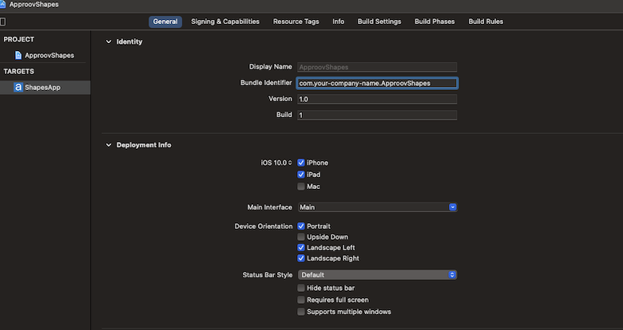

# Shapes Example

This quickstart is written specifically for native iOS apps that are written in ObjectiveC for making the API calls that you wish to protect with Approov. This quickstart provides a step-by-step example of integrating Approov into an app using a simple `Shapes` example that shows a geometric shape based on a request to an API backend that can be protected with Approov.

## WHAT YOU WILL NEED
* Access to a trial or paid Approov account
* The `approov` command line tool [installed](https://approov.io/docs/latest/approov-installation/) with access to your account
* [Xcode](https://developer.apple.com/xcode/) version 16 installed (version 16.4 is used in this guide)
* The contents of this repo
* An Apple mobile device with iOS 12 or higher
* MacOS 11+
* CocoaPods [installed](https://cocoapods.org) (you must use version 1.9+ which offers support for xcframeworks)

## RUNNING THE SHAPES APP WITHOUT APPROOV

Open the `ApproovShapes.xcodeproj` project in the `shapes-app` folder using `File->Open` in Xcode. Ensure the `ApproovShapes` project is selected at the top of Xcode's project explorer panel.

Select your codesigning certificate in the `Signing & Capabilities` tab and run the application on your prefered device. Note that if you have difficulties codesigning the application, change the `Bundle identifier` in the `General` tab to contain a unique prefix.



> Note that from Xcode 14, the minimum deployment target is iOS 11.0 and you will need to update to this in the general settings to allow compilation.

Once the application is running you will see two buttons:

<p>
    
</p>

Click on the `Hello` button and you should see this:

<p>
    
</p>

This checks the connectivity by connecting to the endpoint `https://shapes.approov.io/v1/hello`. Now press the `Shape` button and you will see this (or a different shape):

<p>
    
</p>

This contacts `https://shapes.approov.io/v1/shapes` to get the name of a random shape. This endpoint is protected with an API key that is built into the code, and therefore can be easily extracted from the app.

The subsequent steps of this guide show you how to provide better protection, either using an Approov token or by migrating the API key to become an Approov managed secret.

## ADD THE APPROOV SDK AND THE APPROOV SERVICE NSURLSESSION

Get the latest Approov SDK by using `CocoaPods`. The `Podfile` configuration file is located in the `shapes-app/ApproovShapes` directory and should contain a reference to the latest version of the Approov SDK available for iOS and the `approov-service-nsurlsession` that simplifies the Approov SDK use. The `approov-service-nsurlsession` is actually an open source wrapper layer that allows you to easily use Approov with `NSURLSession`.

Install the dependency by executing:

```
$ pod install
$ Updating local specs repositories
Analyzing dependencies
Downloading dependencies
Installing approov-service-nsurlsession (3.5.3)
Generating Pods project
Integrating client project
Pod installation complete! There is 1 dependency from the Podfile and 1 total pod installed.

[!] Please close any current Xcode sessions and use `ApproovShapes.xcworkspace` for this project from now on.
Pod installation complete!
```

The Approov SDK and `approov-service-nsurlsession` are now included as dependencies in your project.

> **IMPORTANT:**: Please observe `pod install` command output notice regarding the `ApproovShapes.xcworkspace` as it is the correct way to modify the project from this point on.

## ENSURE THE SHAPES API IS ADDED

In order for Approov tokens to be generated for `https://shapes.approov.io/v3/shapes` it is necessary to inform Approov about it:

```
approov api -add shapes.approov.io
```

Approov tokens for this domain will be automatically signed with the specific secret for this domain, rather than the normal one for your account.

## MODIFY THE APP TO USE APPROOV

The `approov-service-nsurlsession` includes the definition and implementation of the `ApproovNSURLSession` class. Import the `ApproovNSURLSession.h` header so we can use its definitions in the `ApproovShapes` project. Uncomment the import statement to `ViewController.m`:

```ObjectiveC
// *** UNCOMMENT THE LINE BELOW TO USE APPROOV
#import "ApproovNSURLSession.h"
```

Now you need to replace `NSURLSession` with `ApproovNSURLSession` and initialize the ApproovService using the apropriate configuration string. The Approov SDK needs a configuration string to identify the account associated with the app. You will have received this in your Approov onboarding email (it will be something like `#123456#K/XPlLtfcwnWkzv99Wj5VmAxo4CrU267J1KlQyoz8Qo=`). Find the `viewDidLoad` function and uncomment the lines indicated:

```ObjectiveC
// *** UNCOMMENT THE LINES BELOW TO USE APPROOV
NSError* error;
[ApproovService initialize:@"<enter-your-config-string-here>" error:&error];
if (error != nil) {
    // bail out due to error
}
defaultSession = [ApproovNSURLSession sessionWithConfiguration:NSURLSessionConfiguration.defaultSessionConfiguration];
```

Lastly, make sure we are using the Approov protected endpoint for the shapes server. Uncomment the line below the comment (commenting the previous definition):

```ObjectiveC
// *** UNCOMMENT THE LINE BELOW FOR APPROOV API PROTECTION
NSString* shapesEndpoint = @"https://shapes.approov.io/v3/shapes";
```

The `ApproovNSURLSession` class adds the `Approov-Token` header and also applies pinning for the connections to ensure that no Man-in-the-Middle can eavesdrop on any communication being made. The `Approov-Token` header is checked by the server at `https://shapes.approov.io/v3/shapes` (along with the API key) and if the validity of the token is verified, a shape should be displayed.

## ADD YOUR SIGNING CERTIFICATE TO APPROOV

You should add the signing certificate used to sign apps. These are available in your Apple development account portal. Go to the initial screen showing program resources:


Click on `Certificates` and you will be presented with the full list of development and distribution certificates for the account. Click on the certificate being used to sign applications from your particular Xcode installation and you will be presented with the following dialog:


Now click on the `Download` button and a file with a `.cer` extension is downloaded, e.g. `development.cer`. Add it to Approov with:

```
approov appsigncert -add development.cer -autoReg
```

This ensures that any app signed with the certificate will be recognized by Approov.

If it is not possible to download the correct certificate from the portal then it is also possible to [add app signing certificates from the app](https://approov.io/docs/latest/approov-usage-documentation/#adding-apple-app-signing-certificates-from-app).

> **IMPORTANT:** Apps built to run on the iOS simulator are not code signed and thus auto-registration does not work for them. In this case you can consider [forcing a device ID to pass](https://approov.io/docs/latest/approov-usage-documentation/#forcing-a-device-id-to-pass) to get a valid attestation.

## RUNNING THE SHAPES APP WITH APPROOV

Run the app (without any debugger attached) and press the `Shape` button. You should now see this (or another shape):

<p>
    
</p>

This means that the app is getting a validly signed Approov token to present to the shapes endpoint.

## WHAT IF I DON'T GET SHAPES

If you still don't get a valid shape then there are some things you can try. Remember this may be because the device you are using has some characteristics that cause rejection for the currently set [Security Policy](https://approov.io/docs/latest/approov-usage-documentation/#security-policies) on your account:

* Ensure that the version of the app you are running is signed with the correct certificate.
* Look at the [`syslog`](https://developer.apple.com/documentation/os/logging) output from the device. Information about any Approov token fetched or an error is printed, e.g. `Approov: Approov token for host: https://approov.io : {"anno":["debug","allow-debug"],"did":"/Ja+kMUIrmd0wc+qECR0rQ==","exp":1589484841,"ip":"2a01:4b00:f42d:2200:e16f:f767:bc0a:a73c","sip":"YM8iTv"}`. You can easily [check](https://approov.io/docs/latest/approov-usage-documentation/#loggable-tokens) the validity.
* Use `approov metrics` to see [Live Metrics](https://approov.io/docs/latest/approov-usage-documentation/#metrics-graphs) of the cause of failure.
* You can use a debugger or simulator and get valid Approov tokens on a specific device by ensuring you are [forcing a device ID to pass](https://approov.io/docs/latest/approov-usage-documentation/#forcing-a-device-id-to-pass). As a shortcut, you can use the `latest` as discussed so that the `device ID` doesn't need to be extracted from the logs or an Approov token.
* Also, you can use a debugger and get valid Approov tokens on any device if you [mark the signing certificate as being for development](https://approov.io/docs/latest/approov-usage-documentation/#development-app-signing-certificates).
* Check the `NSError` variable for detailed error message 

## SHAPES APP WITH SECRETS PROTECTION

This section provides an illustration of an alternative option for Approov protection if you are not able to modify the backend to add an Approov Token check. We are still going to be using `https://shapes.approov.io/v1/shapes/` that simply checks for an API key, so please change the code so it points to `https://shapes.approov.io/v1/shapes/`.

The `apiSecretKey` variable should also be changed to `shapes_api_key_placeholder`, removing the actual API key out of the code:

You must inform Approov that it should map `shapes_api_key_placeholder` to `yXClypapWNHIifHUWmBIyPFAm` (the actual API key) in requests as follows:

```
approov secstrings -addKey shapes_api_key_placeholder -predefinedValue yXClypapWNHIifHUWmBIyPFAm
```

> Note that this command requires an [admin role](https://approov.io/docs/latest/approov-usage-documentation/#account-access-roles).

Next we need to inform Approov that it needs to substitute the placeholder value for the real API key on the `Api-Key` header. You need to add the call at `shapes-app/ApproovShapes/ViewController.m`:

```ObjectiveC
// *** UNCOMMENT THE LINE BELOW FOR APPROOV USING SECRETS PROTECTION
[ApproovService addSubstitutionHeader:apiKeyHeader requiredPrefix:nil];
```

This processes the headers and replaces in the actual API key as required.

Build and run and press the `Get Shape` button. You should now see this (or another shape):

<p>
    
</p>

This means that the app is able to access the API key, even though it is no longer embedded in the app code, and provide it to the shapes request.
