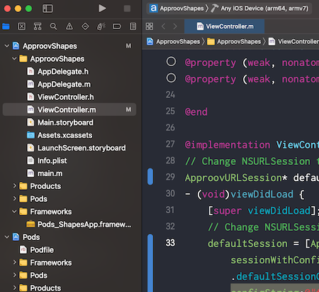

# Shapes Example

This quickstart is written specifically for native iOS apps that are written in ObjectiveC for making the API calls that you wish to protect with Approov. This quickstart provides a step-by-step example of integrating Approov into an app using a simple `Shapes` example that shows a geometric shape based on a request to an API backend that can be protected with Approov.

## WHAT YOU WILL NEED
* Access to a trial or paid Approov account
* The `approov` command line tool [installed](https://approov.io/docs/latest/approov-installation/) with access to your account
* [Xcode](https://developer.apple.com/xcode/) version 12 installed (version 12.3 is used in this guide)
* The contents of this repo
* An Apple mobile device with iOS 10 or higher
* MacOS 11+
* CocoaPods [installed](https://cocoapods.org) (you must use version 1.9+ which offers support for xcframeworks)

## RUNNING THE SHAPES APP WITHOUT APPROOV

Open the `ApproovShapes.xcodeproj` project in the `shapes-app` folder using `File->Open` in Xcode. Ensure the `ApproovShapes` project is selected at the top of Xcode's project explorer panel.

Select your codesigning certificate in the `Signing & Capabilities` tab and run the application on your prefered device. Note that if you have difficulties codesigning the application, change the `Bundle identifier` in the `General` tab to contain a unique prefix.


Once the application is running you will see two buttons:

<p>
    
</p>

Click on the `Hello` button and you should see this:

<p>
    
</p>

This checks the connectivity by connecting to the endpoint `https://shapes.approov.io/v1/hello`. Now press the `Shape` button and you will see this:

<p>
    
</p>

This contacts `https://shapes.approov.io/v2/shapes` to get the name of a random shape. It gets the status code 400 (`Bad Request`) because this endpoint is protected with an Approov token. Next, you will add Approov into the app so that it can generate valid Approov tokens and get shapes.

## ADD THE APPROOV SDK AND THE APPROOV SERVICE NSURLSESSION

Get the latest Approov SDK by using `CocoaPods`. The `Podfile` configuration file is located in the `shapes-app/ApproovShapes` directory and should contain a reference to the latest version of the Approov SDK available for iOS and the approov service that enables the ApproovSDK use. The approov-service-nsurlsession is actually an open source wrapper layer that allows you to easily use Approov with NSURLSession. This has a further dependency to the closed source Approov SDK itself. Install the dependency by executing:

```
$ pod install
Analyzing dependencies
Cloning spec repo `approov` from `https://github.com/approov/approov-service-nsurlsession.git`
Cloning spec repo `approov-1` from `https://github.com/approov/approov-ios-sdk.git`
Downloading dependencies
Installing approov-ios-sdk (2.7.0)
Installing approov-service-nsurlsession (2.7.0)
Generating Pods project
Integrating client project

[!] Please close any current Xcode sessions and use `ApproovShapes.xcworkspace` for this project from now on.
Pod installation complete! There are 2 dependencies from the Podfile and 2 total pods installed.
```

The Approov SDK is now included as a dependency in your project. Please observe `pod install` command output notice regarding the `ApproovShapes.xcworkspace` as it is the correct way to modify the project from this point on.

## ENSURE THE SHAPES API IS ADDED

In order for Approov tokens to be generated for `https://shapes.approov.io/v2/shapes` it is necessary to inform Approov about it:
```
$ approov api -add shapes.approov.io
```
Tokens for this domain will be automatically signed with the specific secret for this domain, rather than the normal one for your account.

## MODIFY THE APP TO USE APPROOV

The approov-service-nsurlsession includes the definition and implementation of the `ApproovURLSession` class. Import the `ApproovURLSession.h` header so we can use its definitions in the `ApproovShapes` project. Add the import statement to `ViewController.m`:

```ObjectiveC
#import "ViewController.h"
#import "ApproovURLSession.h"
```

Find the following lines in `ViewController.m` source file:
```ObjectiveC
// Change NSURLSession to ApproovURLSession
NSURLSession* defaultSession;
- (void)viewDidLoad {
    [super viewDidLoad];
    // Change NSURLSession to ApproovURLSession
    defaultSession = [NSURLSession sessionWithConfiguration:NSURLSessionConfiguration.defaultSessionConfiguration];
}
```
Replace `NSURLSession` with `ApproovURLSession` and remember to include the Approov configuration string as an extra parameter. The Approov SDK needs a configuration string to identify the account associated with the app. You will have received this in your Approov onboarding email (it will be something like `#123456#K/XPlLtfcwnWkzv99Wj5VmAxo4CrU267J1KlQyoz8Qo=`).
```ObjectiveC
// Change NSURLSession to ApproovURLSession
ApproovURLSession* defaultSession;
- (void)viewDidLoad {
    [super viewDidLoad];
    // Change NSURLSession to ApproovURLSession
    defaultSession = [ApproovURLSession sessionWithConfiguration:NSURLSessionConfiguration.defaultSessionConfiguration configString:@"<enter-you-config-string-here>"];
}
```

The `ApproovURLSession` class adds the `Approov-Token` header and also applies pinning for the connections to ensure that no Man-in-the-Middle can eavesdrop on any communication being made. 

## REGISTER YOUR APP WITH APPROOV

In order for Approov to recognize the app as being valid it needs to be registered with the service. This requires building an `.ipa` file using the `Archive` option of Xcode (this option will not be avaialable if using the simulator). Make sure `Any iOS Device` is selected as build destination. This ensures an `embedded.mobileprovision` is included in the application package which is a requirement for the `approov` command line tool. 



We can now build the application by selecting `Product` and then `Archive`. Select the apropriate code signing options and eventually a destination to save the `.ipa` file.

Copy the `ApproovShapes.ipa` file to a convenient working directory. Register the app with Approov:
```
$ approov registration -add ApproovShapes.ipa
registering app ApproovShapes
lhB30o4UMuzjDsdNicQ6QiM6cEcC4Y5k/SF72fID/Es=com.yourcompany-name.ApproovShapes-1.0[1]-6285  SDK:iOS-universal(2.6.0)
registration successful
```

## RUNNING THE SHAPES APP WITH APPROOV

Install the `ApproovShapes.ipa` that you just registered on the device. You will need to remove the old app from the device first. Please note that you need to run the applicaiton with Approov SDK on a real device and not a simulator. If you are using an emulator, you will need to learn how [whitelisting](https://approov.io/docs/latest/approov-usage-documentation/#adding-a-device-security-policy) works since the simulators are not real devices and you will not be able to succesfully authenticate the app.
If using Mac OS Catalina, simply drag the `ipa` file to the device. Alternatively you can select `Window`, then `Devices and Simulators` and after selecting your device click on the small `+` sign to locate the `ipa` archive you would like to install.


Launch the app and press the `Shape` button. You should now see this (or another shape):

<p>
    
</p>

This means that the app is getting a validly signed Approov token to present to the shapes endpoint.

## WHAT IF I DON'T GET SHAPES

If you still don't get a valid shape then there are some things you can try. Remember this may be because the device you are using has some characteristics that cause rejection for the currently set [Security Policy](https://approov.io/docs/latest/approov-usage-documentation/#security-policies) on your account:

* Ensure that the version of the app you are running is exactly the one you registered with Approov.
* If you running the app from a debugger then valid tokens are not issued unless you have [whitelisted](https://approov.io/docs/latest/approov-usage-documentation/#adding-a-device-security-policy) the device.
* Look at the [`syslog`](https://developer.apple.com/documentation/os/logging) output from the device. Information about any Approov token fetched or an error is printed, e.g. `Approov: Approov token for host: https://approov.io : {"anno":["debug","allow-debug"],"did":"/Ja+kMUIrmd0wc+qECR0rQ==","exp":1589484841,"ip":"2a01:4b00:f42d:2200:e16f:f767:bc0a:a73c","sip":"YM8iTv"}`. You can easily [check](https://approov.io/docs/latest/approov-usage-documentation/#loggable-tokens) the validity.
* Consider using an [Annotation Policy](https://approov.io/docs/latest/approov-usage-documentation/#annotation-policies) during development to directly see why the device is not being issued with a valid token.
* Use `approov metrics` to see [Live Metrics](https://approov.io/docs/latest/approov-usage-documentation/#live-metrics) of the cause of failure.
* You can use a debugger or simulator and get valid Approov tokens on a specific device by [whitelisting](https://approov.io/docs/latest/approov-usage-documentation/#adding-a-device-security-policy). As a shortcut, when you are first setting up, you can add a [device security policy](https://approov.io/docs/latest/approov-usage-documentation/#adding-a-device-security-policy) using the `latest` shortcut as discussed so that the `device ID` doesn't need to be extracted from the logs or an Approov token.
